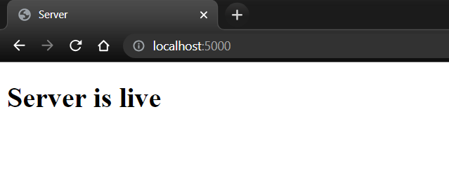

# Multiplayer TicTacToe

built with socket.io


# SETUP SERVER SIDE

its simple

first go inside the 'Server' directory
```
cd .\Server\
```

next, install all the modules required
```
npm install
```
if you get some errror, try this command
```
npm install --force
```
now, in order to start the server, type this
```
npm start
```

CONGRATS! you are done with the server side
you should see this message:
>Server Live at port 5000

In order to check,
you can go to http://localhost:5000/

you should get this:


This confirms that your server side is setup
Now lets setup the Client side

# SETUP CLIENT SIDE